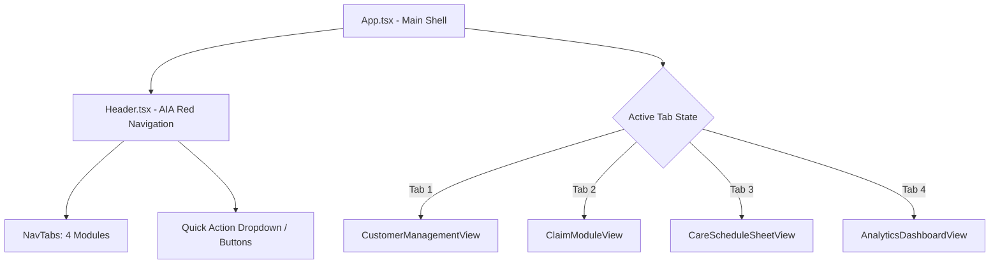

# Phase 1: Foundation & App Navigation Shell

## Overview

Nâng cấp kiến trúc giao diện từ màn hình quản lý claim đơn lẻ thành cấu trúc **App Shell đa phân hệ** chuẩn nhận diện thương hiệu AIA Red (`#D31145`). 

Xây dựng hệ thống điều hướng 4 Tab chính:
1. `Khách hàng & Hợp đồng` (Customer & Policy Directory)
2. `Hồ sơ Bồi thường` (Claim Pipeline & Kanban/Table Views)
3. `Lịch chăm sóc & Follow-up` (Care Schedule & Activity Sheet)
4. `Thống kê & Báo cáo KPI` (Analytics Dashboard)

Tích hợp thanh thông báo trạng thái, định danh Chuyên viên tư vấn Dương Như Ý (`AIA-VN-8869`), widget đếm số lượng việc cần xử lý và chuyển đổi tab phản hồi tức thời không cần tải lại trang.

---

## Key Insights & Requirements

- **Brand Identity:** Giữ trọn vẹn bộ nhận diện AIA Red (`#D31145`), nền `slate-50`, các thẻ panel bo góc mềm mại, typography sắc nét.
- **Header Navigation:**
  - Logo AIA + Tiêu đề hệ thống CRM & Claim.
  - 4 nút Tab có icon trực quan (`Users`, `ShieldAlert`, `CalendarCheck`, `BarChart3`), có badge đếm số lượng (ví dụ: số claim đang xử lý, số sinh nhật sắp tới).
  - Nút hành động nhanh: "Thêm mới" (hỗ trợ tạo nhanh Khách hàng mới, Tạo claim mới, hoặc Thêm nhật ký chăm sóc).
  - Menu tiện ích: Xuất dữ liệu (JSON/CSV), Nhập dữ liệu sao lưu, Khôi phục mặc định.
- **Layout Shell:** Vùng nội dung trung tâm (`<main>`) linh hoạt render component tương ứng với tab đang chọn, giữ nguyên trạng thái tìm kiếm và bộ lọc khi người dùng đổi tab.

---

## Architecture & Component Design

---

## Related Files

### Files to Modify:
- `src/App.tsx`: Nâng cấp state `activeTab` (`'customers' | 'claims' | 'care' | 'analytics'`), render linh hoạt 4 phân hệ.
- `src/components/Header.tsx`: Thêm thanh Tabs điều hướng, badge đếm, dropdown tạo nhanh.

### Files to Create:
- `src/types/navigation.ts`: Khai báo type phân hệ `AppTab = 'customers' | 'claims' | 'care' | 'analytics'`.

---

## Implementation Steps

1. **Định nghĩa Type Navigation:** Tạo `src/types/navigation.ts` khai báo các tab và cấu hình icon, tiêu đề, badge đếm.
2. **Nâng cấp Header Component:**
   - Thêm tab navigation với hiệu ứng active (gạch chân AIA Red hoặc pill nổi bật).
   - Thêm badge hiển thị số lượng hồ sơ claim đang xử lý và số sự kiện chăm sóc khẩn cấp.
   - Thêm nút Quick Action tạo nhanh.
3. **Cập nhật App.tsx Shell:**
   - Quản lý state `activeTab` (mặc định mở tab Bồi thường hoặc Khách hàng).
   - Thiết lập khung render component giữ nguyên layout mượt mà, không bị giật trang.
4. **Kiểm thử giao diện:** Xác nhận chuyển tab hoạt động trơn tru trên cả màn hình Desktop và Mobile (responsive horizontal scroll hoặc hamburger menu).

---

## Todo List

- [ ] Tạo `src/types/navigation.ts` định nghĩa các tab chính của ứng dụng
- [ ] Cập nhật `Header.tsx` hiển thị 4 Tabs điều hướng kèm badge đếm thông minh
- [ ] Cập nhật `App.tsx` quản lý active tab và vùng hiển thị tương ứng
- [ ] Thêm dropdown hoặc button nhóm "Thao tác nhanh" (Tạo KH / Tạo Claim / Ghi nhận chăm sóc)
- [ ] Đảm bảo responsive trên mobile và kiểm tra không có lỗi build type

---

## Success Criteria

- Thanh Header hiển thị rõ ràng 4 Tab điều hướng với style AIA Red chuẩn.
- Bấm vào từng tab thay đổi view tức thì mà không load lại trang.
- Badge đếm hiển thị số lượng tương ứng với dữ liệu thực tế.
- Build kiểm thử `npm run build` thành công không lỗi type.
