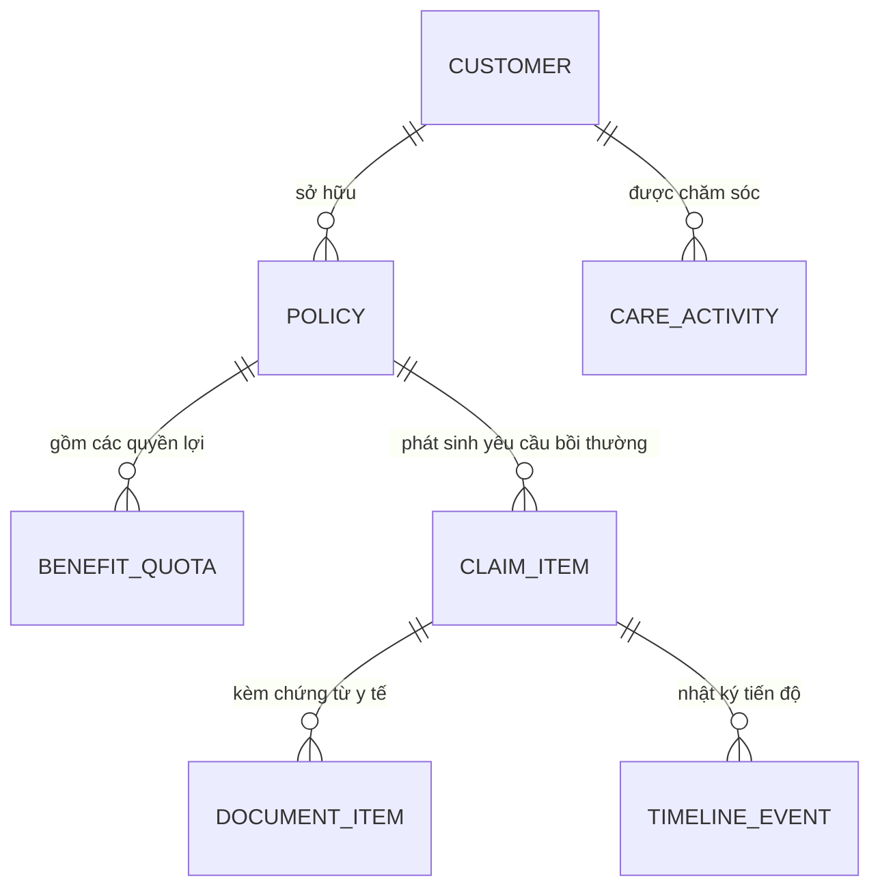

# Phase 2: Domain Schemas and Unified Store

## Overview

Thiết kế mô hình dữ liệu tổng thể (Domain Schemas) bằng TypeScript phản ánh chính xác nghiệp vụ quản lý bảo hiểm nhân thọ AIA Việt Nam. Xây dựng hook quản lý trạng thái tập trung `useCRMStore` kết nối đồng bộ với `localStorage`, cung cấp đầy đủ các thao tác CRUD cho 4 thực thể chính: Khách hàng, Hợp đồng & Quyền lợi, Hồ sơ Bồi thường, và Nhật ký Chăm sóc.

Khởi tạo bộ dữ liệu mẫu (Mock Data) chuẩn thực tế với đầy đủ thông tin khách hàng, số HĐ, hạn mức quyền lợi thẻ sức khỏe, lịch sử claim và nhật ký tư vấn bồi thường của tư vấn viên Dương Như Ý.

---

## Key Insights & Requirements

- **Thực thể Khách hàng (`Customer`):**
  - Định danh: `id`, `name`, `phone`, `cccd`, `birthDate`, `address`, `occupation`, `email`, `notes`, `createdAt`.
- **Thực thể Hợp đồng & Quyền lợi (`Policy` & `BenefitQuota`):**
  - Thông tin HĐ: `id` (Mã số HĐ: `AIA-1108924`), `customerId`, `productName`, `mainCoverageAmount`, `issueDate`, `status` (`'in_force' | 'pending_payment' | 'lapsed' | 'surrendered'`), `billingFrequency` (`'annual' | 'semi_annual' | 'quarterly'`), `premiumAmount`, `nextDueDate`, `gracePeriodEnd`.
  - Danh mục Hạn mức Quyền lợi (`BenefitQuota[]`):
    - Loại quyền lợi: Trợ cấp nằm viện, Chi phí phẫu thuật, Thẻ sức khỏe nội trú, Thẻ ngoại trú, Bệnh hiểm nghèo, Tai nạn.
    - Trường số liệu: `maxLimit` (Hạn mức tối đa/năm), `usedAmount` (Đã chi trả), `remainingLimit` (Còn lại trong năm), `unit` (`'VND' | 'days'`).
- **Thực thể Hồ sơ Claim (`ClaimItem`):**
  - Liên kết chặt chẽ: `customerId`, `policyId`.
  - Kế thừa schema chứng từ y tế (`DocumentItem`), nhật ký thẩm định (`TimelineEvent`), đối chiếu số tiền yêu cầu vs số tiền thực duyệt.
- **Thực thể Nhật ký Chăm sóc (`CareActivity`):**
  - Ghi chú tương tác: `id`, `customerId`, `policyId`, `date`, `channel` (`'meeting' | 'call' | 'zalo' | 'coffee' | 'gift'`), `title`, `content`, `result`, `nextAction`, `nextFollowUpDate`, `status` (`'planned' | 'completed' | 'cancelled'`).
- **Engine Cảnh báo Tự động (`CareAlert`):**
  - Tự động quét theo ngày hiện tại:
    - Sinh nhật khách hàng / người được BH trong 7 ngày tới hoặc trong tháng.
    - Hạn nộp phí bảo hiểm định kỳ sắp tới (trước 15 ngày, 30 ngày) và đếm ngược thời gian gia hạn đóng phí 60 ngày.
    - Thăm hỏi sau bồi thường (sau 3 ngày kể từ khi claim chuyển trạng thái `paid`).

---

## Architecture & Data Flow

---

## Related Files

### Files to Create:
- `src/types/crm.ts`: Khai báo toàn bộ interface `Customer`, `Policy`, `BenefitQuota`, `CareActivity`, `CareAlert`.
- `src/data/mockCRM.ts`: Bộ dữ liệu mẫu phong phú: 8 khách hàng thực tế tại TP.HCM/Hà Nội, 10 hợp đồng AIA, 8 hồ sơ claim, 12 nhật ký chăm sóc.
- `src/hooks/useCRMStore.ts`: Custom hook trung tâm cung cấp state và methods đồng bộ `localStorage`.

### Files to Modify:
- `src/types/claim.ts`: Thêm trường `customerId` và `policyId` liên kết với hệ thống CRM.
- `src/hooks/useClaims.ts`: Tái cấu trúc để ủy quyền hoặc tương thích mượt mà với `useCRMStore`.

---

## Implementation Steps

1. **Định nghĩa Schema TypeScript:** Soạn thảo `src/types/crm.ts` với đầy đủ types, enum labels, màu sắc định dạng trạng thái (hợp đồng hiệu lực, chờ đóng phí, mất hiệu lực).
2. **Xây dựng Bộ Dữ liệu Mẫu (`mockCRM.ts`):** Tạo dữ liệu chân thực mang đậm phong cách bảo hiểm AIA (sản phẩm *Khỏe Trọn Vẹn*, *Trọn Vẹn Cân Bằng*, thẻ bảo lãnh viện phí bệnh viện FV, Vinmec, Chợ Rẫy...).
3. **Phát triển Hook `useCRMStore`:**
   - Đọc dữ liệu ban đầu từ `localStorage` (nếu chưa có thì nạp `mockCRM`).
   - Cung cấp các hàm mutate:
     - `addCustomer`, `updateCustomer`, `deleteCustomer`
     - `addPolicy`, `updatePolicy`, `updateBenefitQuota`
     - `addClaim`, `updateClaimStatus`, `deleteClaim`
     - `addCareActivity`, `updateCareActivity`, `deleteCareActivity`
     - `getAlerts`: Tự động tính toán danh sách cảnh báo sinh nhật và kỳ phí.
     - `exportAllJSON`, `exportAllCSV`, `importAllJSON`, `resetCRMDefault`.
4. **Kiểm tra tính bền vững:** Mở ứng dụng, thay đổi dữ liệu, F5 trang web và xác nhận dữ liệu vẫn giữ nguyên vẹn.

---

## Todo List

- [ ] Tạo file `src/types/crm.ts` chứa đầy đủ model Customer, Policy, BenefitQuota, CareActivity, CareAlert
- [ ] Tạo file `src/data/mockCRM.ts` với bộ dữ liệu mẫu phong phú, chuẩn nghiệp vụ AIA
- [ ] Viết hook `src/hooks/useCRMStore.ts` quản lý state toàn hệ thống và lưu trữ `localStorage`
- [ ] Cài đặt thuật toán tự động tính toán cảnh báo ngày sinh, hạn đóng phí và thăm hỏi sau claim
- [ ] Bổ sung các tiện ích Export/Import dữ liệu tổng thể và Reset dữ liệu gốc
- [ ] Chạy build kiểm thử `npm run build` đảm bảo không có lỗi type

---

## Success Criteria

- Toàn bộ 4 phân hệ dữ liệu có cấu trúc schema rõ ràng, chặt chẽ, type-safe 100%.
- Dữ liệu lưu trữ tự động vào `localStorage` key `aia_crm_store_v1`.
- Quét cảnh báo trả về đúng danh sách sinh nhật trong tuần/tháng và các hợp đồng sắp đến hạn đóng phí.
- Không phát sinh lỗi TypeScript khi compile.
