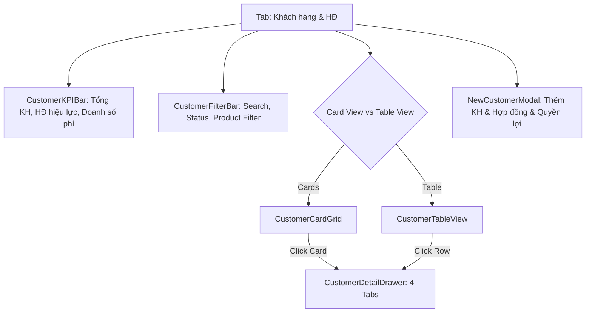

# Phase 3: Customer and Policy Management

## Overview

Xây dựng phân hệ **Quản lý Hồ sơ Khách hàng & Hợp đồng Bảo hiểm** (`Customer & Policy Management Hub`). Cho phép tư vấn viên Dương Như Ý tra cứu thông tin khách hàng, số điện thoại, địa chỉ, số CCCD, danh sách hợp đồng đang quản lý và đặc biệt là **bảng hạn mức quyền lợi bảo hiểm** (thẻ sức khỏe nội trú, ngoại trú, trợ cấp nằm viện, tai nạn, bệnh hiểm nghèo...).

Cung cấp thanh KPI tổng quan tệp khách hàng, bộ lọc đa năng, chế độ xem thẻ / bảng trực quan, Slide-over Drawer xem chi tiết hồ sơ toàn diện và Modal thêm/sửa khách hàng mới.

---

## Key Insights & Requirements

- **Thanh KPI Khách hàng & Hợp đồng:**
  - Tổng số khách hàng đang quản lý.
  - Số khách hàng mới trong tháng hiện tại.
  - Số hợp đồng đang duy trì hiệu lực (`in_force`) vs HĐ chờ nộp phí (`pending_payment`).
  - Tổng doanh số phí bảo hiểm thường niên đang quản lý (VND).
- **Bộ lọc & Tìm kiếm Tức thời:**
  - Ô tìm kiếm linh hoạt: Tên khách hàng, Số điện thoại, Số HĐ (`AIA-xxxx`), Số CCCD, Địa chỉ.
  - Lọc theo trạng thái hợp đồng: *Tất cả, Đang hiệu lực, Chờ nộp phí, Mất hiệu lực*.
  - Lọc theo gói sản phẩm: *AIA Khỏe Trọn Vẹn, AIA Trọn Vẹn Cân Bằng...*
- **Chế độ hiển thị danh sách (Dual Views):**
  - *Card View:* Mỗi thẻ đại diện cho một khách hàng, hiển thị thông tin liên hệ, số lượng HĐ, nhãn trạng thái và thanh tiến trình hạn mức thẻ sức khỏe (đã dùng bao nhiêu / còn lại bao nhiêu).
  - *Table View:* Bảng dữ liệu chi tiết cho màn hình lớn với các cột thông tin chuẩn chỉnh.
- **Slide-over Drawer Chi tiết Khách hàng (`CustomerDetailDrawer`):**
  - **Tab 1 - Hồ sơ & Liên hệ:** Tên, Ngày sinh, CCCD, Địa chỉ, Số điện thoại (kèm nút gọi nhanh và mở chat Zalo).
  - **Tab 2 - Danh sách Hợp đồng & Quyền lợi:** Chi tiết từng hợp đồng, định kỳ đóng phí, ngày đến hạn phí tiếp theo. Bảng quyền lợi trực quan có thanh phần trăm (Progress bar) thể hiện: *Hạn mức năm, Số tiền đã bồi thường, Hạn mức còn lại*.
  - **Tab 3 - Lịch sử Bồi thường:** Danh sách các hồ sơ claim mà khách hàng này đã từng nộp (mã claim, ngày vào viện, bệnh viện, số tiền duyệt).
  - **Tab 4 - Lịch sử Chăm sóc:** Toàn bộ nhật ký tư vấn, gặp gỡ, thăm hỏi của tư vấn viên với khách hàng này.
- **Modal Thêm / Cập nhật Khách hàng & HĐ (`NewCustomerModal`):**
  - Form nhập thông tin khách hàng.
  - Khởi tạo hợp đồng và chọn gói quyền lợi mẫu hoặc tùy chỉnh hạn mức.

---

## Architecture & Component Design

---

## Related Files

### Files to Create:
- `src/components/CustomerManagementView.tsx`: View chính phân hệ Khách hàng.
- `src/components/CustomerCard.tsx`: Component thẻ khách hàng trực quan.
- `src/components/CustomerTableView.tsx`: Component bảng danh sách khách hàng.
- `src/components/CustomerDetailDrawer.tsx`: Slide-over drawer 4 tab chi tiết.
- `src/components/NewCustomerModal.tsx`: Modal tạo/chỉnh sửa khách hàng và hợp đồng.

### Files to Modify:
- `src/App.tsx`: Tích hợp `CustomerManagementView` khi `activeTab === 'customers'`.

---

## Implementation Steps

1. **Xây dựng Component `CustomerManagementView`:** Thiết lập thanh KPI đo lường và thanh công cụ tìm kiếm, lọc trạng thái hợp đồng.
2. **Phát triển `CustomerCard` và `CustomerTableView`:**
   - Hiển thị thông tin liên hệ và trạng thái hợp đồng bằng màu sắc AIA Red / Emerald / Amber.
   - Thể hiện thanh đo lường hạn mức thẻ sức khỏe (ví dụ: *Đã dùng 35.000.000đ / 250.000.000đ - Còn lại 86%*).
3. **Phát triển `CustomerDetailDrawer`:**
   - Thiết kế giao diện slide-over mượt mà, phân chia 4 tabs rõ ràng.
   - Nút hành động nhanh: `tel:` (gọi điện thoại) và liên kết `zalo.me/` tiện lợi.
   - Hiển thị danh sách quyền lợi chi tiết và liên kết xem nhanh hồ sơ claim tương ứng.
4. **Phát triển `NewCustomerModal`:**
   - Hỗ trợ thêm khách hàng mới kèm thông tin hợp đồng và hạn mức quyền lợi ban đầu.
5. **Kiểm thử trải nghiệm:** Thử tìm kiếm khách hàng, mở drawer xem chi tiết quyền lợi, thêm khách hàng mới và xác nhận cập nhật ngay lập tức.

---

## Todo List

- [ ] Tạo `CustomerManagementView.tsx` với thanh KPI và bộ lọc tìm kiếm
- [ ] Xây dựng `CustomerCard.tsx` hiển thị thông tin và thanh hạn mức quyền lợi y tế
- [ ] Xây dựng `CustomerTableView.tsx` hiển thị dạng bảng chi tiết
- [ ] Xây dựng `CustomerDetailDrawer.tsx` với 4 tab (Thông tin, Hợp đồng & Quyền lợi, Lịch sử claim, Lịch sử chăm sóc)
- [ ] Xây dựng `NewCustomerModal.tsx` tạo mới khách hàng và cấu hình hợp đồng
- [ ] Tích hợp vào `App.tsx` và kiểm tra tương tác mượt mà

---

## Success Criteria

- Hiển thị đầy đủ danh sách khách hàng mẫu kèm thông tin hợp đồng AIA và hạn mức quyền lợi.
- Tìm kiếm theo Tên, SĐT, Số HĐ, CCCD trả về kết quả tức thì.
- Thanh tiến trình hạn mức thẻ sức khỏe phản ánh trực quan số tiền đã dùng và số dư còn lại.
- Drawer mở mượt mà, hiển thị đầy đủ 4 tab dữ liệu liên kết.
- Tạo khách hàng mới thành công và lưu ngay vào `localStorage`.
