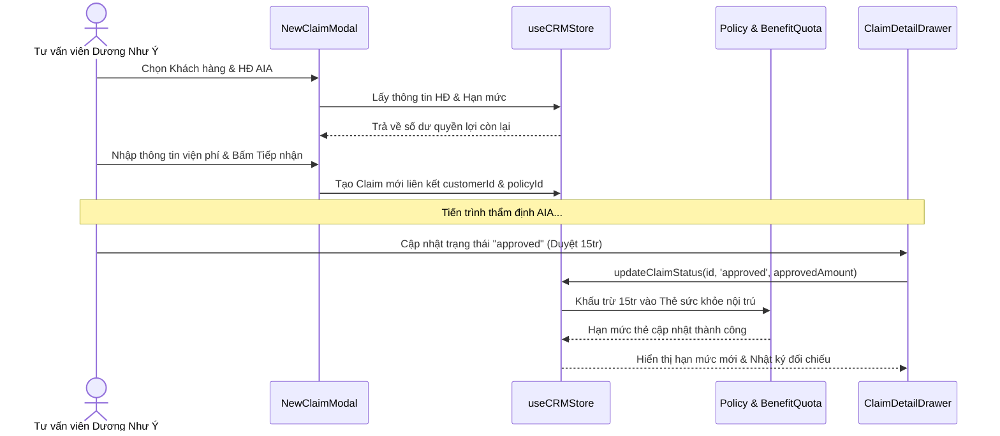

# Phase 4: Claim Integration and Benefit Utilization

## Overview

Tích hợp chặt chẽ phân hệ Quản lý Hồ sơ Bồi thường (Claim Pipeline) với Hồ sơ Khách hàng và Hợp đồng bảo hiểm. Khi tiếp nhận hồ sơ bồi thường mới, tư vấn viên có thể chọn nhanh từ danh sách Khách hàng/Hợp đồng sẵn có để tự động điền toàn bộ thông tin cá nhân và kiểm tra trước hạn mức quyền lợi còn lại.

Đặc biệt, hiện thực hóa tính năng **Đối chiếu Quyền lợi Tự động (Benefit Utilization Engine)**: Khi hồ sơ claim được AIA thẩm định và chuyển trạng thái sang `Đã duyệt (approved)` hoặc `Đã chuyển khoản (paid)`, hệ thống sẽ tự động cập nhật trừ số tiền duyệt vào hạn mức quyền lợi tương ứng của hợp đồng, đồng thời cảnh báo nếu số tiền claim vượt quá hạn mức còn lại trong năm.

---

## Key Insights & Requirements

- **Liên kết Khách hàng & Hợp đồng khi tạo Claim:**
  - Trong `NewClaimModal`, bổ sung dropdown tìm kiếm và chọn nhanh Khách hàng.
  - Khi chọn khách hàng, tự động load danh sách Hợp đồng của khách đó, tự động điền: Họ tên, Số HĐ, SĐT, Số CCCD, Tên sản phẩm AIA.
  - Hiển thị ngay hạn mức quyền lợi còn lại tương ứng với loại quyền lợi được chọn (ví dụ: *Quyền lợi Nằm viện còn 4.500.000đ; Thẻ sức khỏe nội trú còn 215.000.000đ*).
- **Đối chiếu Quyền lợi trong Slide-over Claim Drawer:**
  - Hiển thị khối thông tin **"Đối chiếu Quyền lợi Hợp đồng"**:
    - Loại quyền lợi áp dụng.
    - Hạn mức tối đa theo năm của hợp đồng.
    - Hạn mức đã sử dụng trước ca này.
    - Số tiền khách hàng yêu cầu bồi thường.
    - Số tiền AIA thực duyệt chi trả (Approved Amount) & Số tiền giảm trừ kèm lý do (nếu có).
    - Cảnh báo trực quan màu đỏ nếu số tiền yêu cầu vượt quá hạn mức còn lại.
- **Cơ chế Tự động Khấu trừ & Hoàn trả Hạn mức:**
  - Khi chuyển trạng thái sang `approved` hoặc `paid`: Hệ thống ghi nhận số tiền `approvedAmount` vào `usedAmount` của `BenefitQuota`, tự động tính lại `remainingLimit`.
  - Nếu chuyển trạng thái ngược lại (ví dụ từ `approved` sang `rejected` do AIA từ chối vào phút chót): Hệ thống tự động hoàn trả lại số tiền đã trừ vào hạn mức.
- **Nâng cấp Bảng & Kanban Claim:**
  - Thêm thẻ tag hiển thị tên khách hàng và tỷ lệ quyền lợi được giải quyết.
  - Lọc hồ sơ claim theo khách hàng cụ thể.

---

## Architecture & Data Flow

---

## Related Files

### Files to Modify:
- `src/components/NewClaimModal.tsx`: Thêm bộ chọn Khách hàng / Hợp đồng và hiển thị số dư quyền lợi tức thì.
- `src/components/ClaimDetailDrawer.tsx`: Thêm khối Đối chiếu Quyền lợi HĐ và xử lý cập nhật trạng thái kèm điều chỉnh hạn mức.
- `src/components/ClaimTableView.tsx` & `src/components/ClaimKanbanView.tsx`: Hiển thị thông tin đối chiếu và liên kết khách hàng.
- `src/hooks/useCRMStore.ts`: Viết logic tự động khấu trừ và hoàn trả hạn mức quyền lợi khi trạng thái claim thay đổi.

---

## Implementation Steps

1. **Cập nhật Store Logic:** Thêm hàm `syncBenefitQuotaOnClaimChange(claimId, oldStatus, newStatus, approvedAmount)` trong `useCRMStore`.
2. **Nâng cấp `NewClaimModal`:**
   - Thêm dropdown chọn khách hàng có sẵn hoặc chọn nhập thủ công.
   - Khi chọn khách hàng, binding tự động các trường liên quan.
   - Render thông tin tóm tắt hạn mức quyền lợi còn lại ngay phía dưới ô chọn loại claim.
3. **Nâng cấp `ClaimDetailDrawer`:**
   - Bổ sung section **"Đối chiếu Hạn mức & Quyền lợi Bảo hiểm"**.
   - Input cho phép nhập số tiền AIA thực duyệt chi trả (`approvedAmount`), số tiền giảm trừ (`deductedAmount`) và lý do giảm trừ (`deductionReason`).
   - Hiển thị badge đối chiếu: *Trong hạn mức (An toàn)* hoặc *Vượt hạn mức (Cảnh báo)*.
4. **Kiểm thử luồng đối chiếu:**
   - Tạo claim mới cho khách hàng A với số tiền 20.000.000đ.
   - Chuyển trạng thái sang "Đã duyệt" với số tiền 18.000.000đ.
   - Mở hồ sơ khách hàng A tại Tab 1 và kiểm tra hạn mức thẻ sức khỏe đã được trừ chính xác 18.000.000đ.

---

## Todo List

- [ ] Cài đặt logic tự động tính toán trừ / hoàn hạn mức quyền lợi trong `useCRMStore.ts`
- [ ] Bổ sung bộ chọn Khách hàng & Hợp đồng trong `NewClaimModal.tsx`
- [ ] Thêm giao diện đối chiếu hạn mức quyền lợi chi tiết trong `ClaimDetailDrawer.tsx`
- [ ] Thêm cảnh báo khi số tiền yêu cầu vượt quá hạn mức còn lại trong năm
- [ ] Kiểm tra tính toàn vẹn dữ liệu khi chuyển đổi qua lại giữa các trạng thái claim

---

## Success Criteria

- Tạo claim mới tự động fill thông tin khách hàng từ dropdown chỉ với 1 click.
- Thao tác duyệt claim tự động trừ tiền vào hạn mức quyền lợi của hợp đồng khách hàng.
- Hạn mức hiển thị trên Drawer và Hồ sơ khách hàng luôn khớp nhau 100%.
- Không có lỗi build type và chuyển trạng thái mượt mà.
