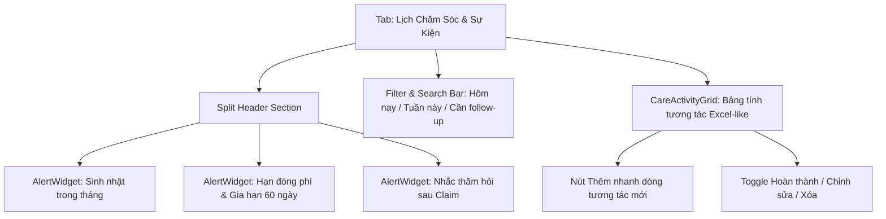

# Phase 5: Care Schedule Sheet and Upcoming Events

## Overview

Xây dựng phân hệ **Sheet Lịch Chăm Sóc Khách Hàng & Trung Tâm Sự Kiện Sắp Tới** (`Care Schedule & Upcoming Events Hub`). Đây là công cụ đắc lực giúp chuyên viên tư vấn Dương Như Ý quản lý toàn bộ các tương tác chăm sóc khách hàng hàng ngày (gọi điện, gặp cafe, nhắn Zalo, thăm hỏi viện phí), ghi chú kết quả và việc cần làm tiếp theo (next action) để không bao giờ bỏ sót khách hàng.

Đồng thời, phân hệ tích hợp cơ chế tự động quét và cảnh báo các sự kiện trọng yếu: **Sinh nhật khách hàng sắp tới**, **Hạn đóng phí bảo hiểm định kỳ** (kèm đếm ngược thời gian gia hạn đóng phí 60 ngày - Grace Period), và **Nhắc nhở gọi thăm hỏi sau khi AIA chi trả bồi thường**.

---

## Key Insights & Requirements

- **Sheet Lịch Chăm Sóc Khách Hàng (`CareScheduleSheet`):**
  - Thiết kế dạng **Bảng tương tác nhanh (Spreadsheet Grid)** giống Excel/Notion, trực quan và tiện thao tác:
    - **Cột 1 - Ngày:** Ngày thực hiện cuộc gặp hoặc ngày tương tác.
    - **Cột 2 - Khách hàng & HĐ:** Tên khách hàng (click để mở drawer) và số HĐ liên quan.
    - **Cột 3 - Kênh tương tác:** Biểu tượng & nhãn trực quan (*Gặp cafe, Gọi điện thoại, Nhắn Zalo, Gửi quà, Thăm viện*).
    - **Cột 4 - Nội dung tư vấn / trao đổi:** Tóm tắt ngắn gọn vấn đề trao đổi (VD: *Tư vấn nâng cấp thẻ sức khỏe, Hướng dẫn bổ sung hóa đơn viện phí BV FV...*).
    - **Cột 5 - Kết quả:** Tình trạng hiện tại (VD: *Khách đồng ý, Đang cân nhắc, Đã nhận đủ chứng từ...*).
    - **Cột 6 - Việc cần làm tiếp theo (Next Action):** Hành động cụ thể cần làm (VD: *In bảng minh họa mới, Gửi thư chúc mừng...*).
    - **Cột 7 - Ngày hẹn tiếp theo:** Thời hạn cần follow-up tiếp theo.
    - **Cột 8 - Trạng thái:** Toggle bấm 1-click để đổi giữa `Cần làm (planned)` ➔ `Đã xong (completed)`.
  - Hỗ trợ thêm nhanh một dòng mới (Quick-add) hoặc mở modal chi tiết.
  - Bộ lọc thông minh: *Hôm nay, Tuần này, Cần follow-up gấp, Đã xong, Quá hạn*.

- **Trung Tâm Sự Kiện & Cảnh Báo (`CareAlertsHub` / `UpcomingEventsWidget`):**
  - **1. Cảnh báo Sinh nhật:**
    - Quét danh sách khách hàng và người được bảo hiểm có ngày sinh trong 7 ngày tới hoặc trong tháng hiện tại.
    - Hiển thị ngày sinh, tính tuổi mới, nút bấm nhanh để: Gọi điện chúc mừng (`tel:`) hoặc Mở Zalo nhắn tin (`zalo.me/`).
  - **2. Cảnh báo Hạn đóng phí bảo hiểm (Kỳ phí RYP):**
    - Hợp đồng đến kỳ đóng phí trong 15 - 30 ngày tới: Nhắc tư vấn viên liên hệ nhắc phí bảo hiểm.
    - Hợp đồng đang trong **Thời gian gia hạn nộp phí 60 ngày (Grace Period)**: Đếm ngược số ngày còn lại (ví dụ: *Còn 14 ngày gia hạn - Nguy cơ mất hiệu lực cao!*).
  - **3. Chăm sóc sau Bồi thường (Post-claim follow-up):**
    - Tự động tạo nhắc việc: *Gọi điện thăm hỏi khách hàng sau 3 ngày kể từ khi AIA duyệt chi trả claim*. Giúp nâng cao chất lượng dịch vụ khách hàng 5 sao.

---

## Architecture & Component Design

---

## Related Files

### Files to Create:
- `src/components/CareScheduleView.tsx`: View chính phân hệ Lịch chăm sóc.
- `src/components/CareScheduleSheet.tsx`: Component bảng tương tác spreadsheet.
- `src/components/UpcomingEventsWidget.tsx`: Widget cảnh báo sinh nhật, kỳ phí và thăm hỏi.
- `src/components/NewCareActivityModal.tsx`: Modal thêm ghi chú chăm sóc chi tiết.

### Files to Modify:
- `src/App.tsx`: Tích hợp `CareScheduleView` khi `activeTab === 'care'`.
- `src/hooks/useCRMStore.ts`: Cung cấp các hàm thêm/sửa/xóa và toggle trạng thái hoạt động chăm sóc.

---

## Implementation Steps

1. **Phát triển `UpcomingEventsWidget`:**
   - Xây dựng 3 tab/khối cảnh báo: Sinh nhật, Hạn đóng phí (Grace period countdown), và Chăm sóc sau claim.
   - Thêm nút tắt tiện ích mở Zalo hoặc gọi điện thoại.
2. **Phát triển `CareScheduleSheet`:**
   - Dựng giao diện table dạng bảng tính, bo viền sạch sẽ, hover nổi bật dòng.
   - Cài đặt tính năng toggle trạng thái hoàn thành trực tiếp trên từng dòng.
   - Bổ sung thanh công cụ lọc theo thời gian: Hôm nay, Tuần này, Tất cả.
3. **Phát triển `NewCareActivityModal`:**
   - Form chọn khách hàng, chọn kênh tương tác, nhập nội dung, kết quả và ngày hẹn tiếp theo.
4. **Kiểm thử trải nghiệm:**
   - Thử thêm 1 hoạt động chăm sóc mới.
   - Kiểm tra widget sinh nhật và hạn đóng phí hiển thị đúng khách hàng trong tập mock data.
   - Bấm hoàn thành 1 việc và kiểm tra trạng thái cập nhật tức thì.

---

## Todo List

- [ ] Tạo `UpcomingEventsWidget.tsx` hiển thị cảnh báo sinh nhật, hạn đóng phí và sau claim
- [ ] Tạo `CareScheduleSheet.tsx` hiển thị dạng bảng tương tác nhanh với tính năng toggle trạng thái
- [ ] Tạo `NewCareActivityModal.tsx` để nhập liệu nhật ký tư vấn / chăm sóc
- [ ] Tạo `CareScheduleView.tsx` ghép nối các widget và sheet chăm sóc
- [ ] Tích hợp vào `App.tsx` và kiểm tra hoạt động mượt mà

---

## Success Criteria

- Sheet chăm sóc hiển thị đầy đủ các cột: Ngày, Khách hàng, Kênh, Nội dung, Kết quả, Việc tiếp theo, Trạng thái.
- Có thể thêm mới và toggle hoàn thành tương tác trực tiếp chỉ với 1 click.
- Widget sự kiện quét chính xác danh sách sinh nhật trong tháng và hợp đồng sắp đến hạn đóng phí.
- Dữ liệu tương tác được lưu trữ bền vững trong `localStorage`.
