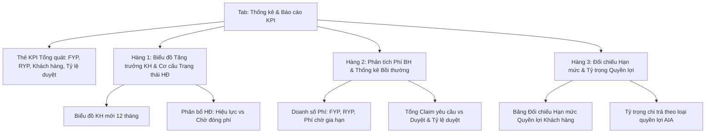

# Phase 6: Multi-Dimensional Analytics Dashboard

## Overview

Xây dựng phân hệ **Báo cáo & Thống kê KPI Đa Chiều** (`Analytics Dashboard & Business Intelligence`) dành cho chuyên viên tư vấn Dương Như Ý. Phân hệ tổng hợp toàn bộ các dữ liệu từ Khách hàng, Hợp đồng, Phí bảo hiểm và Bồi thường claim để đưa ra bức tranh toàn cảnh về hiệu quả kinh doanh và chất lượng phục vụ khách hàng.

Các chỉ số được trực quan hóa sinh động bằng biểu đồ thanh, thẻ phân bổ tỷ trọng phần trăm, chỉ số đo lường hiệu suất và bảng đối chiếu hạn mức quyền lợi bảo hiểm, hỗ trợ xuất báo cáo ra file Excel/CSV.

---

## Key Insights & Requirements

- **1. Thống kê Khách hàng Mới theo Tháng (Monthly Customer Growth):**
  - Biểu đồ tăng trưởng lượng khách hàng tham gia bảo hiểm theo 12 tháng gần nhất (sử dụng Tailwind CSS Bar Chart mượt mà, không phụ thuộc thư viện nặng).
  - Thống kê tốc độ tăng trưởng tháng này so với tháng trước.
- **2. Cơ cấu Hợp đồng theo Trạng thái (Policy Status Breakdown):**
  - Phân bổ số lượng và tỷ trọng phần trăm:
    - *Hợp đồng đang có hiệu lực (`in_force`)*: Màu xanh lục (Emerald).
    - *Hợp đồng chờ đóng phí (`pending_payment`)*: Màu hổ phách (Amber).
    - *Hợp đồng mất hiệu lực (`lapsed`)*: Màu đỏ xám (Rose/Slate).
  - Thước đo tỷ lệ duy trì hợp đồng (Persistency Rate K1/K2 - chỉ số sống còn của đại lý bảo hiểm).
- **3. Phân tích Doanh số Phí Bảo hiểm theo Trạng thái (Premium Analytics):**
  - **Phí Năm Đầu (FYP - First Year Premium):** Đo lường năng suất khai thác mới.
  - **Phí Tái Tục (RYP - Renewal Year Premium):** Đo lường tính ổn định của danh mục khách hàng.
  - **Phí Đang Chờ Thu / Trong hạn gia hạn 60 ngày:** Cảnh báo dòng tiền cần tập trung thu gấp để bảo toàn hiệu lực hợp đồng cho khách hàng.
  - **Tổng quy mô Phí bảo hiểm thường niên (Annualized Premium Equivalent - APE):** Đo lường thứ hạng của tư vấn viên Dương Như Ý tại văn phòng AIA Exchange.
- **4. Thống kê Bồi thường & Tỷ lệ Chi trả (Claims & Approval Rate):**
  - **Tổng tiền khách hàng yêu cầu bồi thường (Claimed Amount):** Tổng giá trị các ca nộp.
  - **Tổng tiền AIA thực duyệt chi trả (Approved Amount):** Số tiền thực tế tiền về tài khoản khách hàng.
  - **Tỷ lệ duyệt thành công (Approval Rate %):** Tỷ lệ hồ sơ được duyệt (ví dụ: *92.5%*).
  - **Cơ cấu chi trả theo loại quyền lợi:** Biểu đồ tỷ trọng bồi thường (*Thẻ sức khỏe nội trú, Trợ cấp nằm viện, Chi phí phẫu thuật, Bệnh hiểm nghèo, Tai nạn...*).
- **5. Bảng Đối chiếu & Mức độ Khai thác Quyền lợi (Benefit Utilization Balance Sheet):**
  - Thống kê mức độ sử dụng hạn mức trung bình của toàn bộ danh mục khách hàng.
  - Danh sách top khách hàng có mức độ sử dụng hạn mức cao (> 70%) để tư vấn viên chủ động lên kế hoạch nâng cấp hạn mức thẻ sức khỏe năm sau.

---

## Architecture & Component Design

---

## Related Files

### Files to Create:
- `src/components/AnalyticsDashboardView.tsx`: View chính phân hệ Thống kê Báo cáo.
- `src/components/MonthlyGrowthChart.tsx`: Biểu đồ tăng trưởng khách hàng theo tháng.
- `src/components/PolicyStatusDistribution.tsx`: Phân bổ hợp đồng và doanh số phí.
- `src/components/ClaimSettlementAnalytics.tsx`: Thống kê claim yêu cầu vs duyệt chi trả.
- `src/components/BenefitUtilizationReport.tsx`: Bảng đối chiếu tỷ lệ sử dụng hạn mức quyền lợi.

### Files to Modify:
- `src/App.tsx`: Tích hợp `AnalyticsDashboardView` khi `activeTab === 'analytics'`.

---

## Implementation Steps

1. **Xây dựng Logic Tính toán Chỉ số:** Viết các hàm aggregator trong `useCRMStore` để tính toán: doanh số FYP/RYP, nhóm khách hàng theo tháng tạo, phân bổ claim theo quyền lợi.
2. **Phát triển Biểu đồ `MonthlyGrowthChart`:** Dựng biểu đồ cột responsive thể hiện số lượng khách hàng mới mỗi tháng, có tooltip hiển thị chi tiết khi rê chuột.
3. **Phát triển `PolicyStatusDistribution`:** Dựng các thanh phân bổ phần trăm hiển thị tỷ trọng hợp đồng hiệu lực và doanh số phí tương ứng.
4. **Phát triển `ClaimSettlementAnalytics`:** Trực quan hóa số tiền yêu cầu vs số tiền thực duyệt bằng thanh đối chiếu song song và tỷ lệ % phê duyệt.
5. **Phát triển `BenefitUtilizationReport`:** Liệt kê các hợp đồng có mức độ dùng thẻ sức khỏe cao kèm cảnh báo.
6. **Kiểm tra tính chính xác:** Thử tạo thêm hợp đồng hoặc duyệt claim mới, chuyển sang tab Thống kê và kiểm tra toàn bộ số liệu và biểu đồ tự động cập nhật chính xác.

---

## Todo List

- [ ] Tạo `AnalyticsDashboardView.tsx` làm khung chứa chính cho phân hệ báo cáo
- [ ] Xây dựng `MonthlyGrowthChart.tsx` hiển thị biểu đồ khách hàng mới theo tháng
- [ ] Xây dựng `PolicyStatusDistribution.tsx` phân tích hợp đồng và doanh số phí FYP/RYP
- [ ] Xây dựng `ClaimSettlementAnalytics.tsx` đối chiếu số tiền yêu cầu vs duyệt chi trả
- [ ] Xây dựng `BenefitUtilizationReport.tsx` tổng hợp tỷ lệ sử dụng hạn mức thẻ
- [ ] Tích hợp vào `App.tsx` và kiểm tra độ nhạy của biểu đồ

---

## Success Criteria

- Biểu đồ thể hiện trực quan lượng khách hàng mới 12 tháng gần nhất.
- Báo cáo phân biệt rõ ràng doanh số Phí năm đầu (FYP), Phí tái tục (RYP) và Phí đang chờ thu.
- Đối chiếu số tiền yêu cầu bồi thường vs số tiền thực tế AIA duyệt chi trả kèm tỷ lệ duyệt %.
- Báo cáo đối chiếu quyền lợi hiển thị chính xác mức độ sử dụng hạn mức của từng hợp đồng.
- Không có lỗi type và giao diện hiển thị đẹp mắt, sắc nét.
