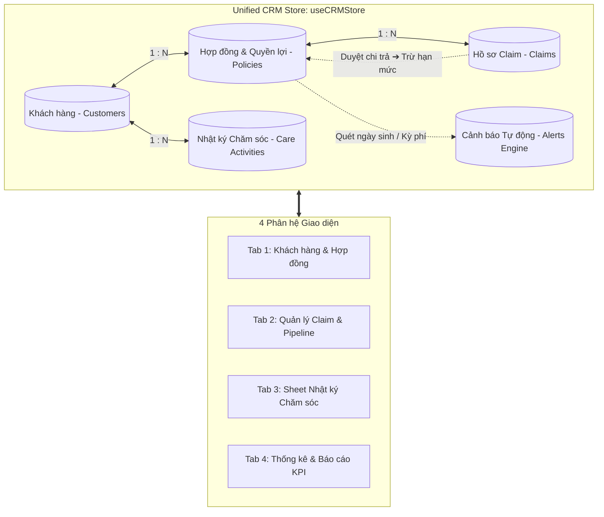

# AIA Agent CRM & Claim Management System - Tư vấn viên Dương Như Ý

## Overview

Hệ thống **All-in-One CRM & Quản lý Nghiệp vụ Bảo hiểm** chuyên biệt dành riêng cho Chuyên viên tư vấn **Dương Như Ý** (Mã TVV: `AIA-VN-8869`, Văn phòng AIA Exchange Bitexco). 

Dự án mở rộng từ công cụ quản lý bồi thường ban đầu thành một nền tảng quản trị khép kín toàn diện 4 phân hệ chính:
1. **Quản lý Hồ sơ Khách hàng & Hợp đồng (Customer & Policy Profile):** Lưu trữ thông tin cá nhân, danh sách hợp đồng bảo hiểm, trạng thái hiệu lực, định kỳ đóng phí và hạn mức quyền lợi chi tiết (nội trú, ngoại trú, trợ cấp viện phí, bệnh hiểm nghèo...).
2. **Quản lý Hồ sơ Bồi thường (Claim Pipeline & Drawer):** Theo dõi tiến độ duyệt bồi thường (Kanban & Table), rà soát chứng từ y tế, tự động đối chiếu và trừ dần vào hạn mức quyền lợi còn lại của hợp đồng.
3. **Sheet Nhật ký Chăm sóc & Sự kiện Sắp tới (Care Schedule & Alerts):** Bảng tính tương tác ghi chú lịch gặp/tư vấn, việc cần làm (next action); trung tâm cảnh báo sinh nhật và hạn đóng phí định kỳ (kèm đếm ngược gia hạn 60 ngày).
4. **Báo cáo & Thống kê KPI Đa chiều (Analytics Dashboard):** Phân tích tăng trưởng khách hàng theo tháng, cơ cấu trạng thái hợp đồng, doanh thu phí bảo hiểm (FYP/RYP), tỷ lệ duyệt claim và tỷ trọng chi trả theo loại quyền lợi.

Toàn bộ hệ thống vận hành mượt mà trên nền tảng React 19 + TypeScript + Tailwind CSS v4, lưu trữ bền vững tại Client (`localStorage`) kèm cơ chế Export/Import toàn diện ra JSON/CSV để sao lưu và bảo mật tuyệt đối dữ liệu khách hàng.

---

## Goals

| # | Mục tiêu hệ thống | Mức ưu tiên |
|---|-------------------|-------------|
| 1 | Xây dựng thanh Navigation Shell 4 phân hệ chuẩn nhận diện thương hiệu AIA Red (`#D31145`) gắn danh tính tư vấn viên Dương Như Ý | P1 |
| 2 | Quản lý danh bạ Khách hàng & Hợp đồng, trực quan hóa hạn mức quyền lợi bảo hiểm và số dư còn lại trong năm | P1 |
| 3 | Tích hợp luồng Bồi thường Claim với Hợp đồng khách hàng, tự động đối chiếu và trừ vào hạn mức khi claim được duyệt | P1 |
| 4 | Cung cấp Sheet Nhật ký Chăm sóc dạng bảng tính tương tác, hỗ trợ ghi chú nhanh nội dung gặp gỡ và lịch hẹn kế tiếp | P1 |
| 5 | Tự động phát hiện và cảnh báo các sự kiện: Sinh nhật khách hàng trong tuần/tháng, hợp đồng đến hạn đóng phí, gia hạn 60 ngày | P1 |
| 6 | Dashboard phân tích đa chiều: Tăng trưởng KH theo tháng, Trạng thái HĐ, Doanh số phí (FYP/RYP), Thống kê claim yêu cầu vs được duyệt | P1 |
| 7 | Đảm bảo tính toàn vẹn dữ liệu ngoại tuyến qua LocalStorage, hỗ trợ sao lưu Export và khôi phục Import file JSON/CSV | P1 |

---

## System Architecture & Data Flow

---

## Phases

| # | Phase | Mục tiêu chính | Trạng thái |
|---|-------|----------------|------------|
| 1 | [Foundation & Navigation Shell](./phase-01-start.md) | Thiết kế layout 4 tab Navigation chuẩn AIA Red, Consultant Header & Status Badges | Pending |
| 2 | [Domain Schemas & Unified Store](./phase-02-domain-schemas-and-unified-store.md) | Xây dựng Schema TypeScript đầy đủ, Store LocalStorage đồng bộ và Mock Data thực tế | Pending |
| 3 | [Customer & Policy Management](./phase-03-app-navigation-and-customer-management.md) | Giao diện Danh bạ Khách hàng, chi tiết Hợp đồng, hạn mức quyền lợi và Drawer chi tiết | Pending |
| 4 | [Claim Integration & Benefit Deduction](./phase-04-claim-integration-and-benefit-utilization.md) | Kết nối Claim với Hợp đồng, tính năng tự động đối chiếu và trừ hạn mức quyền lợi | Pending |
| 5 | [Care Schedule Sheet & Upcoming Events](./phase-05-care-schedule-sheet-and-upcoming-events.md) | Bảng tính ghi chú chăm sóc KH tương tác và Trung tâm cảnh báo Sinh nhật / Hạn đóng phí | Pending |
| 6 | [Multi-Dimensional Analytics Dashboard](./phase-06-multi-dimensional-analytics-dashboard.md) | Dashboard biểu đồ KH mới theo tháng, cơ cấu HĐ, doanh số phí và tỷ lệ duyệt claim | Pending |
| 7 | [Verification & End-to-End Testing](./phase-07-verification-and-end-to-end-testing.md) | Kiểm thử khép kín toàn bộ luồng nghiệp vụ, kiểm tra Export/Import và build production | Pending |

---

## Success Criteria

- [ ] Header chuyển đổi mượt mà giữa 4 phân hệ: Khách hàng & HĐ, Bồi thường, Lịch chăm sóc, Thống kê.
- [ ] Xem danh sách khách hàng, tìm kiếm tức thì theo Tên, SĐT, Số HĐ, CCCD; hiển thị tiến trình sử dụng hạn mức quyền lợi y tế.
- [ ] Drawer chi tiết khách hàng thể hiện đầy đủ hợp đồng, các quyền lợi kèm theo (nội trú, ngoại trú, viện phí, hiểm nghèo), lịch sử claim và lịch sử chăm sóc.
- [ ] Khi tạo claim mới, có thể chọn nhanh từ danh sách Khách hàng/Hợp đồng sẵn có; khi claim chuyển sang Đã duyệt/Đã thanh toán, hệ thống tự động trừ tiền vào hạn mức quyền lợi tương ứng.
- [ ] Sheet Chăm sóc khách hàng cho phép ghi chú nhanh các cuộc gọi/gặp gỡ, hẹn ngày tiếp theo và phân loại việc cần làm.
- [ ] Banner / Widget sự kiện hiển thị đúng danh sách sinh nhật sắp tới và các hợp đồng đến hạn nộp phí (cảnh báo 15 ngày & đếm ngược gia hạn 60 ngày).
- [ ] Phân hệ Báo cáo trực quan hóa đầy đủ: Khách hàng mới theo tháng, Trạng thái hợp đồng, Doanh số phí (FYP/RYP), và Tỷ lệ duyệt chi trả claim.
- [ ] Tính năng Export JSON/CSV và Import phục hồi dữ liệu hoạt động chính xác với toàn bộ dữ liệu 4 phân hệ.
- [ ] Dự án build thành công với `npm run build` không có lỗi TypeScript hay cảnh báo giao diện.

<!-- slug: aia-agent-crm -->
