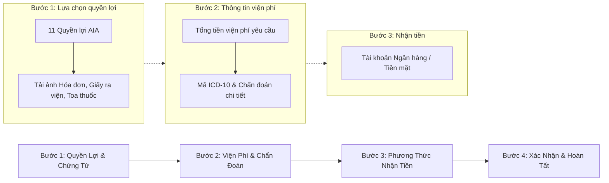

# AIA 4-Step Claim Intake Wizard & Vercel Deployment Release

## Overview

Kế hoạch chuẩn hóa quy trình tiếp nhận hồ sơ bồi thường bảo hiểm nhân thọ AIA theo đúng **4 bước thực tế** trên cổng đại lý ủy quyền AIA Việt Nam (`aia.com.vn`) thu thập từ 9 ảnh tư liệu thực tế tại thư mục `D:\Desktop\claim`.

Giải quyết triệt để 3 vấn đề cốt lõi của tư vấn viên Dương Như Ý:
1. **Quy trình 4 Bước chuẩn AIA:** Đồng bộ 11 loại quyền lợi bồi thường, nhập viện phí, chẩn đoán ICD-10 và phương thức nhận tiền (ngân hàng/tiền mặt).
2. **Kho lưu trữ ảnh chứng từ vĩnh viễn (Medical Document Vault):** Đính kèm ảnh hóa đơn VAT, giấy ra viện, toa thuốc, bảng kê chi tiết; xem lại bằng trình chiếu phóng to toàn màn hình (Lightbox), xóa bỏ nỗi lo Zalo xóa mất ảnh sau 1–2 tháng.
3. **Đồng bộ Danh bạ từ hệ thống công ty:** Nhập danh sách khách hàng và hợp đồng hàng loạt từ Excel/CSV trong 1 click.
4. **Triển khai Online lên Vercel:** Đưa ứng dụng lên Internet với link HTTPS miễn phí cho tư vấn viên và cộng sự test thử nghiệp vụ.

---

## Goals

| # | Mục tiêu hệ thống | Mức ưu tiên |
|---|-------------------|-------------|
| 1 | Chuẩn hóa Modal Tạo Claim thành Wizard 4 bước: 1. Quyền lợi & Chứng từ ➔ 2. Chi tiết viện phí & Chẩn đoán ➔ 3. Phương thức nhận tiền ➔ 4. Xác nhận | P1 |
| 2 | Danh mục giấy tờ y tế tự động đổi theo loại quyền lợi (Hóa đơn\*, Sổ khám/Toa thuốc\*, Bảng kê ra viện, Giấy phẫu thuật, Xét nghiệm) | P1 |
| 3 | Tích hợp Trình xem ảnh y tế phóng to toàn màn hình (Zoom, Xoay, Tải về) lưu trữ vĩnh viễn | P1 |
| 4 | Cung cấp công cụ Import danh bạ khách hàng từ Excel/CSV sao chép từ cổng công ty | P1 |
| 5 | Cấu hình Vercel SPA rewrites và kiểm thử production build thành công 100% | P1 |

---

## AIA 4-Step Intake Workflow

---

## Phases

| # | Phase | Mục tiêu chính | Trạng thái |
|---|-------|----------------|------------|
| 1 | [Architecture & Stepper Design](./phase-01-start.md) | Khung Wizard 4 bước chuẩn AIA và thanh tiến trình Stepper trực quan | Pending |
| 2 | [4-Step Claim Intake Wizard UI](./phase-02-4-step-claim-intake-wizard-matching-aia-portal.md) | Hiện thực hóa 4 bước nhập liệu: Quyền lợi, Chứng từ, Viện phí & Ngân hàng | Pending |
| 3 | [Medical Document Vault & Lightbox](./phase-03-medical-document-vault-and-instant-lightbox-viewer.md) | Kho lưu trữ ảnh y tế và trình chiếu phóng to toàn màn hình (DocumentImageViewer) | Pending |
| 4 | [Customer Bulk Import & Agency Sync](./phase-04-customer-bulk-import-and-synchronization.md) | Nhập hàng loạt khách hàng và số hợp đồng từ Excel/CSV của cổng công ty | Pending |
| 5 | [Release & Vercel Deployment](./phase-05-release-github-connection-and-vercel-deployment.md) | Cấu hình Vercel, kiểm tra build và bàn giao link webapp online | Pending |

---

## Success Criteria

- [ ] Wizard tạo hồ sơ mới có 4 bước rõ ràng với thanh tiến trình Stepper (1 ➔ 2 ➔ 3 ➔ 4).
- [ ] Bước 1 hỗ trợ đủ 11 loại quyền lợi chuẩn AIA và danh mục giấy tờ tương ứng.
- [ ] Cho phép tải nhiều ảnh chứng từ y tế và hiển thị ảnh thu nhỏ thumbnail ngay trong form.
- [ ] Slide-over Drawer cho phép bấm vào từng ảnh chứng từ để phóng to toàn màn hình soi số tiền.
- [ ] Nút "Nhập Excel" tại danh bạ khách hàng nạp thành công dữ liệu bảng tính.
- [ ] Lệnh `npm run build` thành công không lỗi type, sẵn sàng chạy trên Vercel.

<!-- slug: aia-portal-wizard-and-deploy -->
