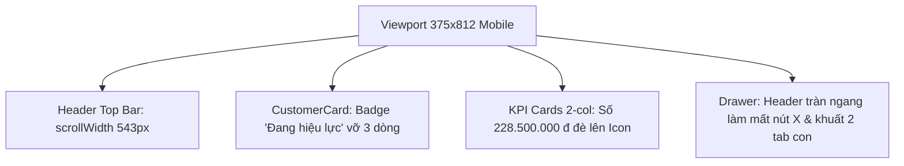

# Mobile Responsive Overhaul - AIA CRM & Claim Hub

## 1. Brainstorm & Delivery Contract

- **Outcome:** Giao diện hiển thị vừa khít 100% khung nhìn điện thoại (`375px`, `scrollWidth === clientWidth === 375`), toàn bộ 4 tab điều hướng chính hiển thị trực quan không bị khuất, thẻ khách hàng và thẻ KPI không bị đè chữ/vỡ dòng, và Slide-over Drawer hiển thị đầy đủ nút đóng `X` cùng 4 tab con trên màn hình nhỏ.
- **Constraints:** Giữ nguyên trải nghiệm Desktop (`lg:` / `xl:`) đã tối ưu trước đó; không thay đổi cấu trúc state hay dữ liệu `localStorage`.
- **Non-goals:** Không thay đổi logic nghiệp vụ tính toán hạn mức hay quy trình tạo hồ sơ bồi thường.
- **Acceptance Criteria:**
  1. Trên viewport `375x812`: `document.documentElement.scrollWidth === 375` (không còn tràn ngang `543px`).
  2. Thanh điều hướng 4 phân hệ hiển thị dạng lưới 2x2 gọn gàng trên mobile (`< 640px`) hoặc thanh ngang đầy đủ trên tablet/desktop (`sm:flex`).
  3. Huy hiệu trạng thái hợp đồng (`Đang hiệu lực`) trên `CustomerCard` luôn nằm trên 1 dòng (`whitespace-nowrap shrink-0`), không bị bóp thành 3 dòng dọc.
  4. Các thẻ KPI tiền tệ (`228.500.000 đ`, `82.271.390 đ`) trên Tab 1 và Tab 4 co giãn font chữ hợp lý trên mobile, không đè lên icon góc phải hoặc tràn khỏi khung thẻ.
  5. `CustomerDetailDrawer` và `ClaimDetailDrawer` mở toàn màn hình trên mobile (`pl-0 sm:pl-10`), hiển thị rõ nút đóng `X` và đầy đủ 4 tab con.

---

## 2. Root Cause Analysis (Evidence from Mobile 375x812 Inspection)

1. **`Header.tsx`**: Tiêu đề `AIA Agent CRM & Claim Hub` dùng `whitespace-nowrap` kết hợp logo + avatar + nút `+ Thêm mới` làm tổng chiều rộng vượt quá `543px`, kéo giãn toàn bộ trang trên mobile. Thanh 4 tab bên dưới dùng `overflow-x-auto` khiến 2 tab cuối (`Lịch chăm sóc`, `Thống kê`) bị khuất hoàn toàn.
2. **`CustomerCard.tsx`**: Badge trạng thái thiếu `whitespace-nowrap shrink-0`, trong khi cột tên khách hàng không có `min-w-0 flex-1`, khiến badge bị ép thành hình tròn 3 dòng.
3. **`CustomerManagementView.tsx` & `AnalyticsDashboardView.tsx`**: Lưới `grid-cols-2` trên mobile chỉ rộng ~165px mỗi thẻ; chuỗi `228.500.000 đ` cỡ chữ `text-lg`/`text-xl` kết hợp icon `w-11 h-11` bên phải gây va chạm trực tiếp.
4. **`CustomerDetailDrawer.tsx` & `ClaimDetailDrawer.tsx`**: Lớp bọc dùng `pl-4` / `pl-10` làm hẹp chiều rộng trên mobile; dòng tổng phí trong header dùng `whitespace-nowrap` đẩy nút `X` ra ngoài màn hình; thanh sub-tabs quá dài làm khuất mất tab `Bồi thường Claim` và `Nhật ký Chăm sóc`.

---

## 3. Implementation Phases
| 1 | [phase-01-header-and-navigation.md](./phase-01-header-and-navigation.md) | Khắc phục tràn ngang Header (543px -> 375px) & bố cục 4 tab điều hướng dạng lưới 2x2 trên mobile | Completed |
| 2 | [phase-02-cards-and-kpi-metrics.md](./phase-02-cards-and-kpi-metrics.md) | Sửa vỡ dòng badge trạng thái trên `CustomerCard` và chống đè chữ KPI trên Tab 1 & Tab 4 | Completed |
| 3 | [phase-03-mobile-drawers.md](./phase-03-mobile-drawers.md) | Tối ưu `CustomerDetailDrawer` & `ClaimDetailDrawer` vừa khít màn hình mobile, rõ nút `X` và đủ 4 tab | Completed |
| 4 | [phase-04-verification-and-deploy.md](./phase-04-verification-and-deploy.md) | Kiểm thử trực quan trên trình duyệt ở 375x812 & 1280x800, chạy `npm run build` và push deploy Vercel | Completed |
| 2 | [phase-02-cards-and-kpi-metrics.md](./phase-02-cards-and-kpi-metrics.md) | Sửa vỡ dòng badge trạng thái trên `CustomerCard` và chống đè chữ KPI trên Tab 1 & Tab 4 | Pending |
| 3 | [phase-03-mobile-drawers.md](./phase-03-mobile-drawers.md) | Tối ưu `CustomerDetailDrawer` & `ClaimDetailDrawer` vừa khít màn hình mobile, rõ nút `X` và đủ 4 tab | Pending |
| 4 | [phase-04-verification-and-deploy.md](./phase-04-verification-and-deploy.md) | Kiểm thử trực quan trên trình duyệt ở 375x812 & 1280x800, chạy `npm run build` và push deploy Vercel | Pending |
