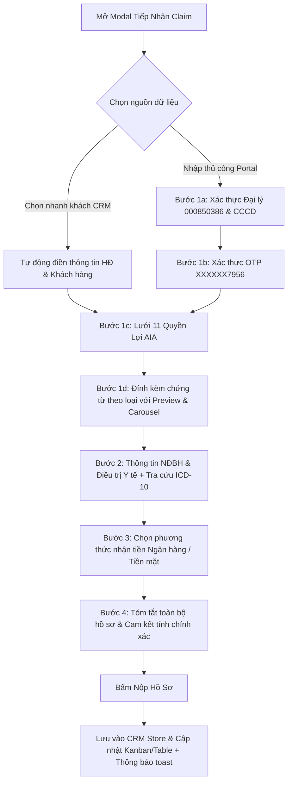

# Kế Hoạch Tích Hợp Quy Trình Claim Bảo Hiểm 4 Bước Chuẩn AIA iClaim

## 1. Bối cảnh & Mục tiêu

Thư mục `D:\Desktop\claim` chứa **9 ảnh chụp màn hình thực tế** của cổng nộp yêu cầu bồi thường trực tuyến **AIA iClaim (`aia.com.vn`)** trên giao diện điện thoại:
1. `1790671836860_..._70d41a2d...jpg`: Màn hình tiếp nhận Đại lý ủy quyền (Mã số đại lý, CCCD/Hộ chiếu Bên mua, Cloudflare Captcha, Điều khoản & Lưu ý nhận tiền).
2. `1790671836883_..._7278f4f4...jpg`: Màn hình xác thực đại lý với mã `000850386` (Dương Thị Như Ý).
3. `1790671006589_..._8ac0bffc...jpg`: Bước 1 - Lựa chọn quyền lợi (11 quyền lợi bồi thường với tooltip thông tin `(i)`).
4. `1790671836900_..._57f52a67...jpg`: Bước 1 - Xác thực OTP gửi về số điện thoại đăng ký `XXXXXX7956`.
5. `1790671836913_..._9f10dace...jpg`: Bước 1 - Đính kèm hồ sơ chuyên biệt theo quyền lợi (Hóa đơn viện phí, Sổ khám/toa thuốc, Bảng kê thanh toán ra viện, Chứng từ khác...).
6. `1790671836925_..._1c748ff5...jpg`: Bước 1 - Trạng thái tải ảnh (preview thumbnail `IMG_8327.jpeg`, điều hướng ảnh `< >`, xóa ảnh, spinner tải hồ sơ).
7. `1790671836935_..._fdf4d353...jpg`: Bước 2 - Nhập thông tin sự kiện & NĐBH (Họ tên, Ngày xảy ra sự kiện, Tổng tiền yêu cầu thanh toán).
8. `1790671836944_..._0de2ec80...jpg`: Bước 2 - Thông tin điều trị & Tra cứu ICD-10 (Tỉnh/Thành phố, Bệnh viện, Nguyên nhân, Tra cứu mã/tên bệnh ICD-10, Chẩn đoán chi tiết theo giấy ra viện).
9. `1790671836952_..._1275aef3...jpg`: Bước 3 - Chọn phương thức thanh toán (Nhận tiền qua tài khoản ngân hàng hoặc Nhận tiền mặt tại ngân hàng).

**Mục tiêu:** Nâng cấp `src/components/NewClaimModal.tsx` từ form cuộn đơn giản hiện tại thành **Wizard 4 bước tương tác chuẩn AIA iClaim** với 2 chế độ:
- **Chế độ 1: Chọn nhanh từ CRM (Tiết kiệm thời gian):** Tự động điền mã đại lý `000850386`, họ tên, số HĐ, CCCD, số điện thoại, quyền lợi hợp đồng sẵn có.
- **Chế độ 2: Trải nghiệm chuẩn Portal AIA iClaim:** Đi qua tuần tự 4 bước `(1) - (2) - (3) - (4)` y hệt như trên điện thoại thực tế của đại lý Dương Thị Như Ý.

---

## 2. Bản đồ luồng người dùng (User Journey & Architecture)

---

## 3. Danh mục các Phase thực thi

| Phase | Tên Phase | Nội dung chính | File chỉnh sửa / tạo mới | Ước tính |
| :--- | :--- | :--- | :--- | :--- |
| **Phase 01** | `phase-01-domain-and-step-1-benefit-docs-wizard.md` | Bộ dữ liệu chuẩn (ICD-10, ngân hàng), Bước 1: Xác thực Đại lý/CCCD, OTP modal, Lưới 11 quyền lợi, Đính kèm ảnh theo danh mục có thumbnail carousel & xóa ảnh | `src/types/claim.ts` `src/data/claimPortalData.ts` `src/components/NewClaimModal.tsx` | 1.0h |
| **Phase 02** | `phase-02-step-2-treatment-and-icd10-diagnosis.md` | Bước 2: Nhập thông tin sự kiện NĐBH, Tỉnh/thành, Bệnh viện, Nguyên nhân sự kiện, Ô tìm kiếm theo mã ICD-10 & tên bệnh, Textarea chẩn đoán chi tiết ra viện | `src/components/NewClaimModal.tsx` `src/utils/formatters.ts` | 0.8h |
| **Phase 03** | `phase-03-step-3-payment-and-step-4-review-submission.md` | Bước 3: Phương thức nhận tiền (Tài khoản ngân hàng / Tiền mặt), Bước 4: Review tóm tắt hồ sơ, Nộp claim và cập nhật `useCRMStore` | `src/components/NewClaimModal.tsx` `src/hooks/useCRMStore.ts` | 0.9h |
| **Phase 04** | `phase-04-responsive-verification-and-smoke-test.md` | Kiểm thử giao diện Mobile (375-430px) chuẩn ảnh thực tế, Desktop, kiểm thử luồng tạo claim, xác thực `npm run build` và `npm run lint` | `plans/verify-iclaim-wizard.png` Verification scripts | 0.8h |

---

## 4. Bảng đối chiếu trường dữ liệu (Data Dictionary)

| Trường trên ảnh AIA iClaim | Kiểu dữ liệu | Ánh xạ vào `ClaimItem` | Ghi chú |
| :--- | :--- | :--- | :--- |
| Mã số Đại lý | string | `agentCode` (`000850386`) | Đại lý Dương Thị Như Ý |
| Số định danh cá nhân / CCCD | string | `customerCccd` | CCCD 12 số |
| Loại quyền lợi (11 loại) | `ClaimType` | `claimType` | Khớp 11 loại trong `CLAIM_TYPE_LABELS` |
| Danh mục chứng từ tải lên | `DocumentItem[]` | `documents` | Hóa đơn, toa thuốc, bảng kê, giấy phẫu thuật... |
| Họ và tên NĐBH | string | `insuredPersonName` | Tên người khám chữa bệnh |
| Ngày xảy ra sự kiện | string (YYYY-MM-DD) | `admissionDate` / `incidentDate` | Ngày khám hoặc nhập viện |
| Tổng tiền yêu cầu (đồng) | number | `claimedAmount` | Format VND real-time |
| Tỉnh/Thành phố | string | `hospitalCity` | Hà Nội, TP.HCM, v.v. |
| Bệnh viện điều trị | string | `hospitalName` | Vinmec, Chợ Rẫy, FV, v.v. |
| Nguyên nhân sự kiện | string | `claimReason` | Ốm đau, tai nạn, khám thai... |
| Mã bệnh ICD-10 & Tên bệnh | string | `icd10Code` + `diagnosis` | Tra cứu thông minh |
| Phương thức thanh toán | 'bank_transfer' \| 'cash' | `paymentMethod` & `bankAccount` | Ngân hàng hoặc Tiền mặt |

---

## 5. Rủi ro & Giải pháp phòng ngừa (Risk Matrix)

1. **Rủi ro:** Wizard nhiều bước làm chậm thao tác của tư vấn viên khi muốn nhập nhanh khách hàng đã có hợp đồng.
   - *Phòng ngừa:* Giữ nguyên dropdown "Chọn nhanh từ danh bạ AIA" ở đầu modal. Khi chọn khách hàng, tự động điền sẵn toàn bộ Bước 1 & Bước 2 (Chỉ cần kiểm tra và bấm Tiếp tục).
2. **Rủi ro:** Tải nhiều ảnh dung lượng lớn làm chậm trình duyệt.
   - *Phòng ngừa:* Sử dụng FileReader tạo DataURL thu nhỏ, giới hạn kích thước thumbnail, phân loại theo đúng mục giấy tờ để dễ tra cứu trong `ClaimDetailDrawer`.
3. **Rủi ro:** Lệch giao diện trên màn hình di động nhỏ (dưới 400px).
   - *Phòng ngừa:* Thiết kế giao diện theo phong cách mobile-first chuẩn như ảnh chụp iPhone từ thư mục `D:\Desktop\claim`.
