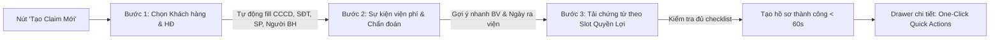

# Plan: Tinh Gọn Quy Trình Tiếp Nhận & Xử Lý Claim Bảo Hiểm (AIA iClaim Streamline)

## 1. Executive Summary
Tối ưu và rút gọn quy trình nộp & thẩm định hồ sơ claim bảo hiểm trong CRM đại lý AIA. Chuyển form nhập thủ công dài dòng hiện tại (`NewClaimModal`) thành **Express 3-Step Wizard** tích hợp tự động điền (Auto-fill 80% từ Customer & Policy), gợi ý bệnh viện nhanh (Top 8 BV phổ biến), và phân loại chứng từ theo slot quyền lợi (Checklist thông minh). Đồng thời bổ sung **One-Click Quick Action Bar** trong `ClaimDetailDrawer` để xử lý hồ sơ và gửi mẫu tin nhắn Zalo/SMS chỉ với 1 chạm.

---

## 2. Architecture & UX Flow

---

## 3. Phase Breakdown

- **Phase 1: Domain & Preset Slots theo Quyền Lợi (`phase-01-benefit-presets-and-store.md`)**
  - Khai báo mapping các quyền lợi chuẩn AIA sang danh mục chứng từ bắt buộc (Giấy ra viện, Bảng kê chi phí, Hóa đơn VAT, Giấy phẫu thuật...).
  - Mở rộng store/mock dữ liệu nếu cần để hỗ trợ template tin nhắn phản hồi nhanh cho tư vấn viên.

- **Phase 2: Thiết kế lại `NewClaimModal` thành Express 3-Step Wizard (`phase-02-express-claim-wizard.md`)**
  - **Step 1 - Thông tin hợp đồng:** Chọn khách hàng $\rightarrow$ Auto-fill CCCD, SĐT, Người được BH, Hợp đồng $\rightarrow$ Chọn Quyền lợi AIA.
  - **Step 2 - Sự kiện điều trị:** Chọn Bệnh viện bằng chip gợi ý nhanh (Vinmec, Chợ Rẫy, FV, Nhi Đồng, Bạch Mai, Đại học Y Dược, Ung Bướu, 115...) hoặc gõ tự do $\rightarrow$ Ngày điều trị $\rightarrow$ Nhập tiền yêu cầu.
  - **Step 3 - Đính kèm chứng từ thông minh:** Các slot tương ứng theo quyền lợi đã chọn (kèm badge "Bắt buộc" / "Tùy chọn") cho phép chụp/upload trực tiếp vào từng ô.
  - Nút điều hướng mượt mà: Có chỉ báo tiến trình trực quan (Step 1/2/3 indicator), phím tắt ESC/Enter, validation tại từng bước.

- **Phase 3: Tinh gọn thao tác trong `ClaimDetailDrawer` & Quick Actions (`phase-03-drawer-quick-actions.md`)**
  - Thêm thanh **Quick Actions Bar** dưới footer drawer:
    - 1-Chạm "Yêu cầu bổ sung chứng từ" (tự sinh tin nhắn Zalo liệt kê danh sách chứng từ còn thiếu).
    - 1-Chạm "Nộp sang cổng iClaim" (chuyển trạng thái sang `underwriting` và thêm timeline log).
    - 1-Chạm "Duyệt chi trả" (mở popup nhập số tiền duyệt & gửi thông báo chúc mừng).
  - Tích hợp sao chép tin nhắn Zalo/SMS nhanh để gửi khách hàng.

- **Phase 4: Smoke Test, Responsive & Verification (`phase-04-verification-and-smoke-test.md`)**
  - Chạy `npm run build` kiểm tra type safety.
  - Test flow tạo claim trên cả Desktop (1280px) và Mobile (375px/412px).
  - Kiểm tra tính toàn vẹn dữ liệu khi tạo xong hiển thị đúng trên Kanban và Table.
