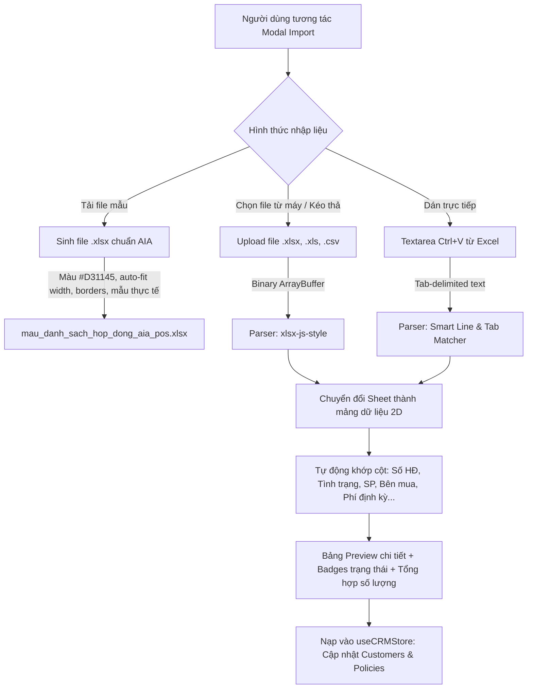

# Plan: Mẫu Excel Chuẩn Thương Hiệu AIA & Nạp Trực Tiếp File .xlsx / .xls

## 1. Bối cảnh & Vấn đề giải quyết
Hiện tại, tính năng nạp dữ liệu khách hàng từ đại lý trong `CustomerImportModal`:
1. **File mẫu chỉ là dạng `.csv` thô sơ**: Mở trên Microsoft Excel Windows không có màu sắc, chữ không in đậm, không có viền ô (borders), độ rộng cột bị co rúm, tiền tệ không định dạng phân tách hàng nghìn, và thường xuyên lỗi font tiếng Việt do khác biệt bảng mã / dấu phân cách `;` vs `,`.
2. **Chưa hỗ trợ nạp trực tiếp file Excel (`.xlsx`, `.xls`)**: Nút tải lên bị giới hạn cứng `accept=".csv,.txt,.tsv"`, khi người dùng chọn file `.xlsx` thật thì hệ thống đọc sai nhị phân (garbled binary text) hoặc không thể chọn file.

**Mục tiêu chính**:
- Tạo file mẫu Excel `.xlsx` chuyên nghiệp, mang đậm bộ nhận diện AIA (Header nền đỏ AIA `#D31145`, chữ trắng nổi bật, font Segoe UI / Calibri, viền ô sắc nét, tự căn chỉnh độ rộng cột, định dạng số tiền `#,##0 đ`, dữ liệu mẫu thực tế kèm chú thích hướng dẫn).
- Cho phép đại lý tải trực tiếp file `.xlsx` / `.xls` / `.csv` từ máy tính hoặc kéo thả (Drag & Drop) vào cửa sổ để nạp dữ liệu tức thì.
- Giữ nguyên trải nghiệm dán nhanh qua clipboard (`Ctrl+C` từ Excel và `Ctrl+V` vào ô văn bản).

---

## 2. Kiến trúc & Luồng xử lý (Architecture & Data Flow)

---

## 3. Phân rã các giai đoạn (Phase Breakdown)

- **Phase 1: Engine `xlsx-js-style` & Tiện ích xuất file mẫu Excel AIA chuẩn (`phase-01-xlsx-engine-and-template-generator.md`)**
  - Cài đặt thư viện `xlsx-js-style`.
  - Tạo helper module `src/utils/excelTemplate.ts`:
    - Hàm `downloadAiaExcelTemplate()`: Sinh file `.xlsx` với styling chuẩn nhận diện AIA (Header đỏ `#D31145`, font trắng đậm, borders mỏng thanh lịch, auto column width, format số tiền VNĐ, các dòng mẫu thực tế chuẩn POS AIA).
    - Hàm `parseExcelFile(file: File)`: Đọc nhị phân `ArrayBuffer` sang 2D row matrix và chuẩn hóa dữ liệu đầu vào.

- **Phase 2: Nâng cấp `CustomerImportModal` hỗ trợ kéo thả & nạp `.xlsx` / `.xls` (`phase-02-modal-ui-drag-drop-and-import-logic.md`)**
  - Mở rộng file input: `accept=".xlsx,.xls,.csv,.txt,.tsv"`.
  - Bổ sung vùng Kéo - Thả file trực quan (Drag & Drop Zone) với hiệu ứng viền nét đứt khi hover và icon trạng thái file.
  - Cập nhật nút *"Tải file mẫu AIA (.xlsx)"* kèm icon Excel sang trọng.
  - Tích hợp pipeline nạp file: hiển thị tên file đã chọn, dung lượng, số lượng dòng phát hiện được.
  - Nâng cấp bảng Preview hiển thị phân khúc, số tiền định kỳ chuẩn format tiền tệ.

- **Phase 3: Kiểm thử toàn diện, Verify & Smoke Test (`phase-03-verification-and-smoke-test.md`)**
  - Chạy `npm run build` & `oxlint` đảm bảo không có lỗi type/linter.
  - Kiểm thử tải file `.xlsx` mẫu: Mở và xác thực trên Microsoft Excel (giao diện, màu sắc, font chữ).
  - Kiểm thử nạp file `.xlsx` và `.csv`: xác nhận hệ thống bóc tách đúng 100% cột dữ liệu và đưa vào CRM store.
  - Chụp ảnh chứng minh nghiệm thu (Smoke Test artifacts).
